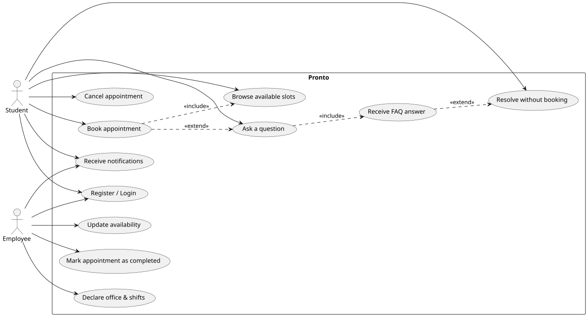

# Requirements

## User stories

Pronto is used by two personas: the **Student**, who needs information or assistance from a university office, and the **Employee**, a staff member of that office.

- **US0 (Student) — Registration.** As a student, I want to create a profile with my personal data (name, surname, student ID, course of study, institutional e-mail), so that I can be identified when booking an appointment.
    - For the scope of this project, the student's institutional e-mail domain (`@studio.unibo.it`) is used to automatically validate the student role at registration time, in place of a full integration with the university's identity provider (Shibboleth/SAML), which would require an official authorization out of scope for a course project.
- **US1 (Employee) — Registration and availability.** As an employee, I want to create a profile indicating my office and working shifts, so that the system can automatically generate the bookable time slots derived from them.
    - Symmetrically to US0, the employee role is validated through the institutional e-mail domain (`@unibo.it`), rather than through manual approval by an administrator.
    - Declaring availability is a separate step from registration, so that an employee can update their shifts afterwards without having to register again.
- **US2 (Student) — Getting help.** As a student, I want to ask a question about a specific office topic, so that I can either get an immediate answer or, failing that, book an appointment with the right office. This is the core story of the system and is refined into the following sub-stories:
    - **US2a — Ask a question.** The student picks the relevant office and submits a free-text question, before browsing any availability.
    - **US2b — FAQ matching.** The system compares the question against a knowledge base of real, anonymised past questions and answers, and suggests the best-matching answer to the student.
    - **US2c — Resolution without booking.** The student decides whether the suggested answer resolves their request. If it does, the flow ends there and no appointment is created.
    - **US2d — Booking as a fallback.** If the suggested answer does not resolve the request (or no relevant match was found), the student browses the office's available time slots, selects one, and books it, with the original question attached for the handling employee.
    - **US2e — Concurrency control.** Two students must never be able to book the same time slot at the same time.
    - **US2f — Equal distribution.** As a student, I only see the available slots of an office, not the individual employee handling them, so that the system is free to distribute incoming requests evenly among the office's staff.
    - **Notifications.** As a student or employee, I want to be notified by e-mail when a new appointment is booked, so that the employee is aware of it and the student has a record of it, without needing to keep the application open.

An additional story was considered and consciously **descoped**: a general-purpose chatbot answering open questions about calls for applications, deadlines, study plans, or enrollment procedures by retrieving information from the university website (a Retrieval-Augmented-Generation-based assistant). Given the already broad scope of Pronto (authentication, scheduling, concurrency control, FAQ matching, staff load-balancing, notifications) and the additional risk this story would introduce — dependency on scraping an external website, unpredictable answer quality, per-query API costs — it was left out of the current iteration in favor of a smaller, better-tested feature set.

## Requirements analysis

### Functional requirements

**Identity & access**

- **FR1**: A student can register, providing name, surname, student ID, course of study, and institutional e-mail, and can subsequently authenticate with e-mail and password.
    - *Acceptance criteria*: given valid, unique registration data, a new student account is created; the student can then log in with the same credentials. Registration is rejected if the e-mail does not belong to the `@studio.unibo.it` domain or is already registered.
- **FR2**: An employee can register, providing name, surname, and office, and can subsequently authenticate with e-mail and password.
    - *Acceptance criteria*: given valid, unique registration data with an e-mail belonging to the `@unibo.it` domain, a new employee account is created; registration is rejected otherwise.
- **FR3**: Authenticated users can only access the actions and data pertinent to their role (student or employee).
    - *Acceptance criteria*: a student cannot access employee-only actions (e.g. declaring availability), and vice versa; unauthenticated requests to protected endpoints are rejected.

**Availability management**

- **FR4**: An employee can declare their office and working shifts; the system computes the corresponding bookable time slots from each shift, on demand, rather than storing them as separate records.
    - *Acceptance criteria*: given a declared shift (e.g. Monday 9:00–12:00) and a fixed slot duration, browsing that office's availability yields a sequence of non-overlapping, contiguous candidate slots covering the whole shift.
- **FR5**: An employee can update their declared shifts after registration, adding or removing availability.
    - *Acceptance criteria*: since time slots are derived from shifts rather than stored, updating a shift immediately changes the availability computed for subsequent browsing; appointments already booked under the previous shift are unaffected.

**Getting help (FAQ matching and booking)**

- **FR6**: A student can ask a question about a given office.
    - *Acceptance criteria*: given an office and a free-text question, the request is recorded and immediately compared against the FAQ knowledge base.
- **FR7**: The system suggests the best-matching FAQ answer for the submitted question, if a sufficiently relevant one exists.
    - *Acceptance criteria*: given a question with at least one sufficiently similar FAQ entry, the corresponding answer is shown to the student; no suggestion is shown if no sufficiently relevant match is found.
- **FR8**: If the student is not satisfied by the suggested answer (or none was found), they can browse the office's available time slots and book one, with the original question attached.
    - *Acceptance criteria*: after booking, the slot is no longer offered to other students, and the appointment is created with the attached question and an initial "booked" status; no appointment is created if the student marks the suggested answer as satisfactory.

**Concurrency and distribution**

- **FR9**: The system prevents two students from booking the same time slot concurrently.
    - *Acceptance criteria*: when two booking requests for the same slot are issued at the same time, exactly one succeeds and the other is rejected with a clear conflict response.
- **FR10**: The system distributes incoming appointment requests evenly among the employees of the target office.
    - *Acceptance criteria*: given multiple employees of the same office with open slots, new bookings are assigned so that no employee accumulates significantly more active appointments than their colleagues.

**Appointment lifecycle**

- **FR11**: A student can cancel a previously booked appointment.
    - *Acceptance criteria*: given a booked appointment belonging to the authenticated student, cancelling it transitions the appointment to the "cancelled" status and frees the corresponding slot.
- **FR12**: An employee can mark a booked appointment as completed once the corresponding meeting has taken place.
    - *Acceptance criteria*: given a booked appointment, the handling employee can mark it completed, transitioning it to the "completed" status.

**Notifications**

- **FR13**: The system notifies the student by e-mail confirming that their appointment has been booked.
- **FR14**: The system notifies the relevant employee by e-mail when a new appointment is booked for their office.
- **FR15**: The system notifies the student by e-mail if their appointment is cancelled.
    - *Acceptance criteria* (FR13–FR15): each listed lifecycle transition results in exactly one e-mail being sent to the correct recipient, containing enough context (office, date/time, question) to act on it without opening the application.

### Non-functional requirements

- **NFR1 — Consistency**: the booking mechanism must guarantee that no two students ever hold a booked appointment on the same time slot, even under simultaneous requests.
- **NFR2 — Responsiveness**: FAQ matching, slot search, and appointment booking should complete within an interactively acceptable time (in the order of seconds) under normal load.
- **NFR3 — Security**: passwords are never stored in clear text; authenticated sessions rely on signed, expiring tokens.
- **NFR4 — Privacy**: the FAQ knowledge base, derived from real historical helpdesk data, is anonymised before being imported, removing any information that could identify the original requester.
- **NFR5 — Reproducibility**: the development, test, and CI environments must be reproducible across machines, so that the observed behaviour (in particular around concurrency) does not depend on who runs it or where.
- **NFR6 — Code quality**: both backend and frontend codebases are covered by automated static analysis (type-checking, linting) and automated tests, with coverage tracked over time.

### Implementation requirements

- **IR1**: The backend is implemented in Python with FastAPI. *Technical*: an async-first web framework fits the I/O-bound booking/notification workload and provides interactive API documentation out of the box.
- **IR2**: Data is persisted in PostgreSQL, accessed through SQLAlchemy (async) with Alembic-managed migrations. *Technical*: NFR1 is best validated against a real DBMS with genuine transactional isolation; a lighter engine would weaken exactly the guarantee Pronto needs to demonstrate.
- **IR3**: The whole stack (backend, database, frontend) is containerized with Docker and orchestrated with Docker Compose, both locally and in CI. *Administrative*: mandated by the course, since it standardizes the environment and is the prerequisite for running integration tests against a real, disposable PostgreSQL instance.
- **IR4**: FAQ matching is implemented, as a baseline, with PostgreSQL full-text search over the anonymised Q&A dataset. *Scope decision*: a vector-based semantic search (e.g. Chroma) is considered only as an optional future enhancement, since it introduces an additional moving part (an embeddings pipeline) on top of an already broad scope.
- **IR5**: Authentication uses JWT, with passwords hashed via bcrypt. *Technical*: a standard, stateless mechanism that fits a REST API consumed by a separate single-page frontend.
- **IR6**: The frontend is implemented with Vue.js. *Team decision*: chosen for the team's familiarity with its tooling (Vite, Vue Router, Pinia), with no external constraint mandating it.
- **IR7**: E-mail notifications are sent through `fastapi-mail`. *Technical*: integrates directly with the async backend without introducing a separate notification service.
- **IR8**: Automated testing relies on `pytest`/`pytest-asyncio`/`httpx`/`pytest-cov` on the backend, and on an equivalent `Vitest`/`ESLint`/`Prettier` toolchain on the frontend. *Administrative*: explicitly required by the course, so that the frontend has a JavaScript-side counterpart to the backend's `pytest`/`mypy` checks.
- **IR9**: Source control follows Conventional Commits and a Gitflow-inspired branching model (`main` / `develop` / `feature/*`), with continuous integration enforced via GitHub Actions on every pull request. *Administrative*: required by the course guidelines to keep a legible, reproducible development history.

## Glossary

| Term | Meaning |
|---|---|
| Student | A user who needs information or assistance from a university office and can book appointments. |
| Employee | A staff member of a university office who declares availability and answers booking requests. |
| Office | An administrative unit of the Cesena Campus (e.g. the job orientation office) that students can book appointments with. |
| Shift | A period of time during which an employee is available to work, declared by the employee. |
| Time slot | A fixed-duration, bookable unit of time derived from an employee's shift. |
| Appointment | The booking of a time slot by a student, together with the attached question and its lifecycle status (booked, cancelled, or completed). |
| Matricola | The Italian term for a student's university identification number. |
| FAQ | An anonymised question/answer pair from the historical helpdesk dataset, used to automatically suggest answers. |
| Match | The outcome of comparing a student's question against the FAQ collection, together with a relevance score. |

## Use-case diagram

