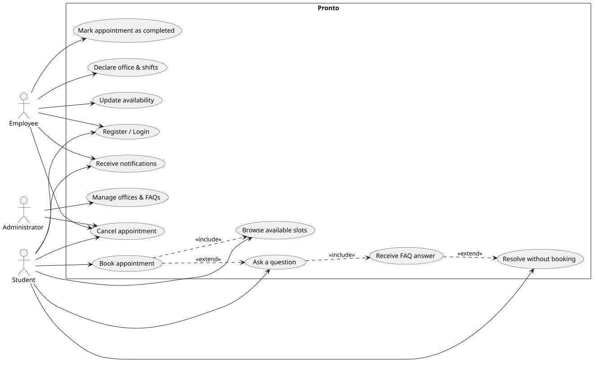

# Requirements

## User stories

Pronto is used by two personas: the **Student**, who needs information or assistance from a university office, and the **Employee**, a staff member of that office.

- **US0 (Student) : Registration.** As a student, I want to create a profile with my personal data (name, surname, student ID, course of study, institutional e-mail), so that I can be identified when booking an appointment. 

    For the scope of this project, the student's institutional e-mail domain (`@studio.unibo.it`) is used to automatically validate the student role at registration time. A future evolution could involve a full integration with the university's identity provider, which would require an official authorization. 
- **US1 (Employee): Registration and availability.** As an employee, I want to create a profile indicating my office and working shifts, so that the system can automatically generate the bookable time slots derived from them.

    Symmetrically to US0, the employee role is validated through the institutional e-mail domain (`@unibo.it`).

    Declaring availability is a separate step from registration, so that an employee can update their shifts afterwards without having to register again.
- **US2 (Student): Getting help.** As a student, I want to ask a question about a specific topic, so that I can either get an immediate answer or, if this fails, book an appointment with the right office. This is the core story of the system and is refined into the following sub-stories:
    - **US2a: Ask a question.** The student picks the relevant office and submits a free-text question, before browsing any availability.
    - **US2b: FAQ matching.** The system compares the question against a knowledge base of real, anonymised questions and answers, and suggests the best-matching answer to the student.
    - **US2c: Resolution without booking.** The student decides whether the suggested answer resolves their request. If it does, the flow ends there and no appointment is created.
    - **US2d: Booking as a fallback.** If the suggested answer does not resolve the request (or no relevant match was found), the student browses the office's available time slots, selects one, and books it, with the original question attached for the handling employee.
    - **US2e: Concurrency control.** Two students must never end up with the same employee on the same time slot, no matter how close in time their requests are.
    - **US2f: Equal distribution.** As a student, I only see the available slots of an office, not the individual employee handling them, so that the system is free to distribute incoming requests evenly among the office's staff.
    - **Notifications.** As a student or employee, I want to be notified by e-mail when a new appointment is booked or cancelled, so that the employee is aware of it and the student has a record of it, without needing to keep the application open.

## Requirements analysis

### Functional requirements

**Identity & access**

- **FR1**: A student can register, providing name, surname, student ID, course of study, and institutional e-mail, and can subsequently authenticate with e-mail and password.

    *Acceptance criteria*: given valid, unique registration data, a new student account is created, inactive, and a verification link is e-mailed to the given address; once the link is opened the account is activated and the student can log in with the same credentials, while login is refused before that. Registration is rejected if the e-mail does not belong to the `@studio.unibo.it` domain or is already registered.
- **FR2**: An employee can register, providing name and surname, and can subsequently authenticate with e-mail and password. The office the employee works for is chosen once, after registration, as the first step of declaring availability (FR4); afterwards only an administrator can move the employee to another office, since the appointments already booked with the old office would otherwise be assigned to someone who no longer works there.
        
    *Acceptance criteria*: given valid, unique registration data with an e-mail belonging to the `@unibo.it` domain, a new employee account is created and activated through the same e-mailed verification link as in FR1; registration is rejected otherwise. Choosing an office a second time is rejected.
- **FR3**: Authenticated users can only access the actions and data pertinent to their role (student or employee). A third role, administrator, is reserved to the staff who run the helpdesk: it is not obtained through registration, and it oversees every appointment and maintains offices and FAQs.

    *Acceptance criteria*: a student cannot access employee-only actions (e.g. declaring availability), and vice versa; a student or employee only sees their own appointments, and someone else's appointment is reported as not found; unauthenticated requests to protected endpoints are rejected.

**Availability management**

- **FR4**: An employee can declare their office and working shifts; the system computes the bookable time slots of an office on demand, from the shifts declared by its employees, rather than storing them as separate records.
   
    *Acceptance criteria*: given a declared shift (e.g. Monday 9:00–12:00) and a fixed slot duration, browsing that office's availability yields a sequence of non-overlapping, contiguous candidate slots covering the whole shift. 

- **FR5**: An employee can update their declared shifts after registration, adding or removing availability.

    *Acceptance criteria*: since time slots are derived from shifts rather than stored, updating a shift immediately changes the availability computed for subsequent browsing.

**Getting help (FAQ matching and booking)**

- **FR6**: A student can ask a question about a given office.

    *Acceptance criteria*: given an office and a free-text question, the question is immediately compared against the FAQ knowledge base and recorded together with the suggested FAQ, if any, without any link to the student who asked it.
- **FR7**: The system suggests the best-matching FAQ answer for the submitted question, if a sufficiently relevant one exists.

    *Acceptance criteria*: given a question with at least one sufficiently similar FAQ entry, the corresponding answer is shown to the student; the FAQs of the chosen office are searched first, and only if none of them is relevant enough are those of every office searched, in which case the answer is shown together with the office it belongs to. No suggestion is shown if no sufficiently relevant match is found.
- **FR8**: If the student is not satisfied by the suggested answer (or none was found), they can browse the office's available time slots and book one, with the original question attached.
        
    *Acceptance criteria*: after booking, the appointment is created with an initial "booked" status, the attached question, and exactly one employee of the office assigned to handle it; the slot keeps being offered to other students as long as at least one employee of the office is still free in it, and disappears from the office's availability once all of them are booked. No appointment is created if the student marks the suggested answer as satisfactory.

**Concurrency and distribution**

- **FR9**: The system prevents two students from being assigned the same employee for the same time slot, even under simultaneous requests.
    
    *Acceptance criteria*: when several booking requests for the same office and time slot are issued at the same time, each either succeeds with a distinct employee assigned, or is rejected with a clear conflict response; the number of successful bookings never exceeds the number of employees of that office available in that slot, and no employee is ever assigned two active appointments on the same slot.

- **FR10**: The system distributes incoming appointment requests evenly among the employees of the target office who are available in the requested slot.
   
   *Acceptance criteria*: given N employees of the same office sharing the same declared shifts, after a sequence of consecutive bookings on that office the difference between the number of active appointments held by any two of them never exceeds one. Under simultaneous requests the assignment is best-effort: the guaranteed invariant is that no employee is ever double-booked (FR9), not that the distribution is perfectly balanced at every instant.

**Appointment lifecycle**

- **FR11**: A booked appointment can be cancelled, before it starts, by the student who booked it, by the employee assigned to it, or by an administrator.
    
    *Acceptance criteria*: given a booked appointment that has not started yet, cancelling it transitions the appointment to the "cancelled" status and frees the corresponding slot; cancelling an appointment that has already started, or that is not in the "booked" status, is rejected.
- **FR12**: An employee can mark a booked appointment as completed once the corresponding meeting has taken place.
    
    *Acceptance criteria*: given a booked appointment whose slot has started, the handling employee can mark it completed, transitioning it to the "completed" status; marking it before the slot starts is rejected. Completing an appointment sends no e-mail.

**Notifications**

- **FR13**: The system notifies the student by e-mail confirming that their appointment has been booked.
- **FR14**: The system notifies the assigned employee by e-mail when a new appointment is booked with them, including the FAQ answer the student was suggested and found unsatisfactory, if any.
- **FR15**: When an appointment is cancelled, the system notifies by e-mail whoever did not cancel it: the employee if the student cancelled, the student if the employee cancelled, and both if an administrator did.
    
    *Acceptance criteria* (FR13–FR15): each listed lifecycle transition results in exactly one e-mail being sent to each of the recipients listed above, containing enough context (office, date/time, question) to act on it without opening the application; the student receives it in the language they asked the question in, the employee in Italian.

### Non-functional requirements

- **NFR1: Consistency**. The booking mechanism must guarantee that no employee ever holds two active appointments on the same time slot, even under simultaneous requests. The fairness of the distribution among colleagues (FR10), by contrast, is a best-effort property, not an invariant.
- **NFR2 : Responsiveness**. FAQ matching, slot search, and appointment booking should complete within an interactively acceptable time (in the order of seconds) under normal load.
- **NFR3: Security**. Passwords are never stored in clear text; only accounts whose institutional e-mail address has been verified can authenticate; authenticated requests carry a random, unguessable token issued at login and revoked at logout.
- **NFR4: Privacy**. The FAQ knowledge base, derived from real historical helpdesk data, is anonymised before being imported, removing any information that could identify the original requester.

    Concretely, FAQs are imported with the `import_faqs` command, which anonymises every text before it is stored, replacing with placeholders: e-mail addresses (except those on the institutional `@unibo.it` domain, which belong to the university, not to the requester), phone numbers, student ID numbers (matricole), Italian tax codes, and person names introduced by a cue (an honorific, a self-introduction or a closing sign-off). Name detection is heuristic: a name without such a cue is not recognised. For this reason imported FAQs are left unpublished until a staff member has reviewed them in the Django admin (unless the import is explicitly run with `--publish`).
- **NFR5: Reproducibility**. The development, test, and CI environments must be reproducible across machines, so that the observed behaviour (in particular around concurrency) does not depend on who runs it or where.

    Concretely, the Poetry version is pinned in a single place (the backend's `Dockerfile`), from which CI reads it; dependencies are locked in `poetry.lock`; the Docker image and CI both run Python 3.12; Docker Compose and CI both use PostgreSQL 16; and the test suite can run on the same database engine as production (PostgreSQL), not only on the default SQLite.
- **NFR6: Code quality**. Both backend and frontend codebases are covered by automated static analysis (type-checking, linting) and automated tests, with coverage tracked over time.

### Implementation requirements and their reasons

- **IR1**: The backend is implemented in Python with Django and Django REST Framework (DRF).

    *Reason: Economic*. Django is "batteries included": ORM and migrations, authentication, the e-mail framework and the admin interface (used by staff to review and maintain the FAQs) come with the framework instead of being assembled from separate libraries, while DRF adds serialisation, authentication and permissions for the REST API consumed by the frontend. This reduces the code the team has to write and maintain.

- **IR2**: Data is persisted in PostgreSQL, accessed through the Django ORM, with the schema managed by Django migrations. Automated tests run on an in-memory SQLite database by default, and on PostgreSQL when `TEST_DATABASE_URL` is set, as CI does.

    *Reason: Economic*. Consistency is best validated against a real DBMS with genuine transactional isolation, avoiding the cost of correctness issues discovered only in production. SQLite keeps local test runs free of any database server, while the tests that need PostgreSQL, such as those of the full-text FAQ matching, run on it in CI.

- **IR3**: The backend, its PostgreSQL database and the Chroma vector store (IR4) are containerized with Docker and orchestrated with Docker Compose: the database runs on the `postgres:16` image and Chroma on the `chromadb/chroma` image, both with a health check, and the backend starts, applying the migrations, only once both report healthy. The frontend is not part of the backend's Compose setup. In CI, the tests run against a PostgreSQL service container based on the same image, while the tests of semantic matching replace the Chroma server with an in-memory Chroma client and the embedding model with a small stand-in.

    *Reason: Economic*. containerization keeps the database used in development, test, and CI identical, cutting the time spent chasing environment-specific bugs.
- **IR4**: FAQ matching combines two techniques in cascade, behind a common matching interface, over the published FAQs of the anonymised Q&A dataset:
    1. **PostgreSQL full-text search** goes first. The question is analysed with the `italian` or `english` text search configuration, according to its language, and ranked against each FAQ with the FAQ's question weighted above its answer; a FAQ is suggested if its rank reaches a configurable threshold (`FAQ_MATCH_MIN_RANK`, 0.45).
    2. **Semantic search with Chroma** is asked only when full-text search finds nothing relevant enough. The question is turned into an embedding by a local multilingual model (`paraphrase-multilingual-MiniLM-L12-v2`, run through `fastembed` on ONNX Runtime) and compared, by cosine similarity, with the embeddings of the FAQs' questions in the same language, stored in the Chroma vector store; a FAQ is suggested if the similarity reaches its own configurable threshold (`FAQ_SEMANTIC_MIN_SIMILARITY`, 0.7).

    The two scores live on different scales and are never compared with each other; every recorded question keeps which of the two techniques found its answer. The whole cascade runs on the office the student chose first, and only if it finds nothing there on all offices. Both thresholds were calibrated on the real FAQ dataset. The vector store is kept in sync with the published FAQs whenever one is saved or deleted, once the transaction commits, and can be rebuilt from the database with the `rebuild_faq_index` command; if Chroma cannot be reached, the error is logged and matching falls back to full-text search alone, so the student still gets an answer or the way to book.

    *Reason: Economic*. both PostgreSQL full-text search and Chroma are free/open-source, and full-text search reuses the existing database infrastructure; computing the embeddings locally avoids the cost of a paid embedding service, and keeps students' questions on the project's own infrastructure. `fastembed` runs the model without PyTorch, keeping the backend's Docker image small.
- **IR5**: Authentication uses DRF token authentication (`TokenAuthentication`): at login the backend issues a random token, stored in the database, which the client sends with every request and which is deleted at logout. Passwords are hashed with Django's password hashing (PBKDF2 by default) and checked against Django's password validators at registration.

    *Reason: Economic*. both mechanisms ship with Django and DRF, so no additional library is needed; a token sent in a request header fits a REST API consumed by a separate single-page frontend, and relying on well-tested framework code minimizes implementation and maintenance effort.
- **IR6**: The frontend is implemented with Vue.js. 

    *Reason: Political*. chosen for the team's familiarity with its tooling (Vite, Vue Router, Pinia), an internal team decision rather than a technical constraint.
- **IR7**: E-mail notifications are sent through Django's e-mail framework: by default e-mails are printed to the console (development), and they are delivered via SMTP when configured through environment variables. Booking e-mails are sent only after the database transaction commits, on a best-effort basis: a failed e-mail is logged and does not undo the booking.

    *Reason: Economic*. integrates directly with the backend without introducing a separate notification service, saving infrastructure and integration cost; the console backend lets developers try the flows without an SMTP account.
- **IR8**: Automated testing relies on `pytest`/`pytest-django`/`coverage` on the backend, and on an equivalent `Vitest`/`ESLint`/`Prettier` toolchain on the frontend. 

    *Reason: Administrative*. both frontend and backend are tested to guarantee quality assurance.

- **IR9**: Source control follows Conventional Commits and a Gitflow-inspired branching model: a stable branch (`master` in the backend repository, `main` in the report repository), an integration branch `develop`, and short-lived branches named after the kind of change (`feature/`, `fix/`, `refactor/`, `test/`, `docs/`, `chore/`), each merged into `develop` through a pull request. CI runs via GitHub Actions on every push and pull request; once a change lands on `develop` and the tests pass, CI also applies the pending migrations to the database the team shares (hosted on Neon), so that its schema always matches `develop`.

     *Reason: Administrative*. the goal is to keep a clear, reproducible development history, and eventually to automate the release.

## Glossary

| Term | Meaning |
|---|---|
| Student | A user who needs information or assistance from a university office and can book appointments. |
| Employee | A staff member of a university office who declares availability and answers booking requests. |
| Office | An administrative unit of the Cesena Campus (e.g. the job orientation office) that students can book appointments with. |
| Shift | A period of time during which an employee is available to work, declared by the employee. |
| Time slot | A fixed-duration window of time that a student can book with an office, derived from the shifts declared by the office's employees. |
| Assignment | The binding of a booked appointment to the specific employee who will handle it, decided by the system rather than chosen by the student. |
| Appointment | The booking of a time slot by a student, together with the attached question and its lifecycle status (booked, cancelled, or completed). |
| Matricola | The Italian term for a student's university identification number. |
| FAQ | An anonymised question/answer pair from the historical helpdesk dataset, used to automatically suggest answers. |
| Match | The outcome of comparing a student's question against the FAQ collection, together with a relevance score. |

## Use-case diagram

