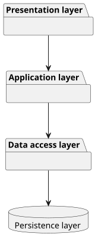
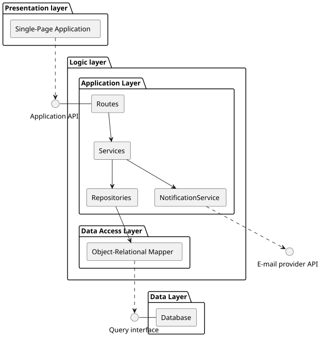
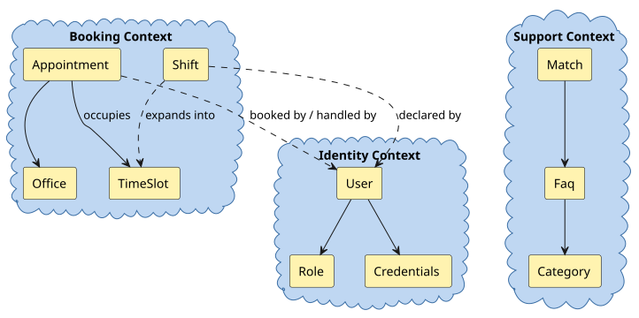
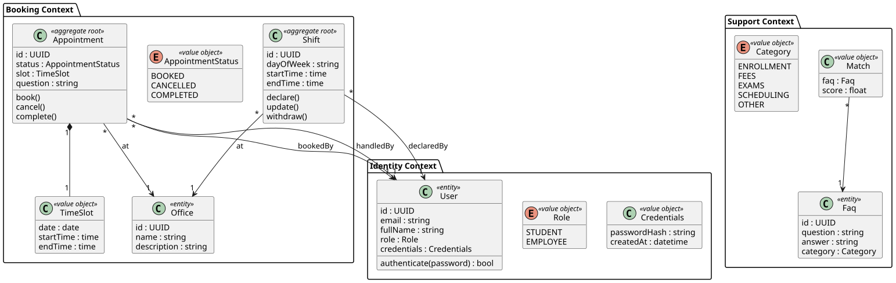
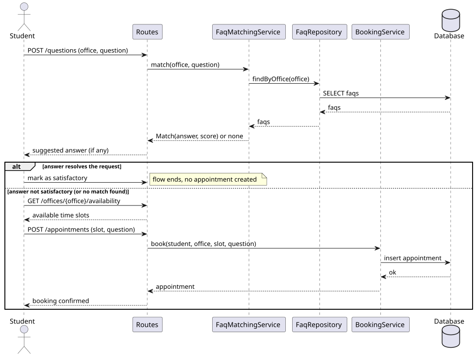
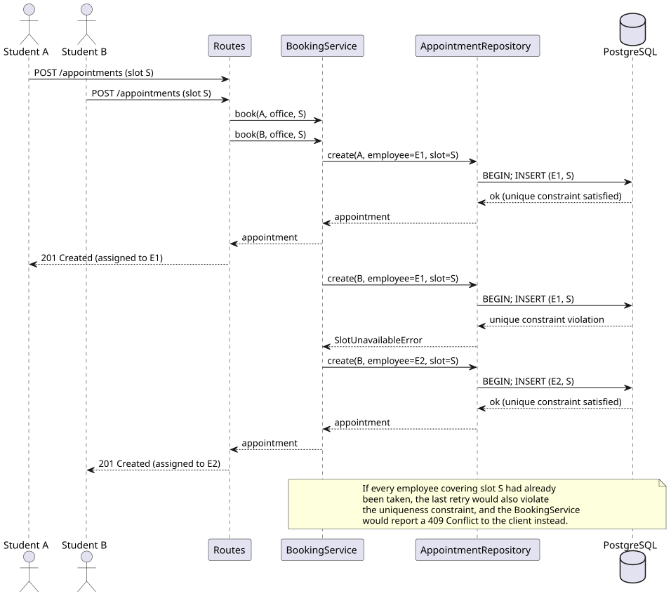
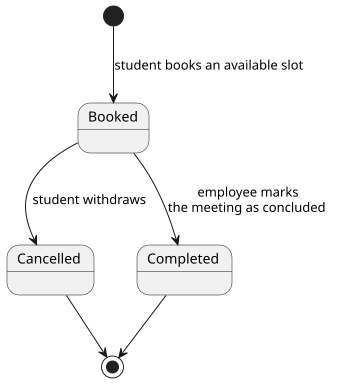

# Design

This chapter describes the design strategies adopted to meet the requirements identified in the analysis. The design is presented independently of the technologies chosen for the implementation.

## Architecture

### Architectural style

Pronto has a **layered** architectural style. The system is organised into four logical layers, each interacting only with the adjacent ones:

- **Presentation layer**: the client application, responsible for the user interface;
- **Application layer**: the backend, responsible for all business logic;
- **Data access layer**: the object-relational mapping component(ORM), responsible for translating between domain objects and storage operations;
- **Persistence layer**: the database, responsible for durably storing data.

This choice reflects the actual communication pattern of the system: every interaction follows a synchronous request/response flow.

We considered and discarded the following alternatives:

- **Event-based**: it implies asynchronous, decoupled communication through a publish/subscribe mechanism, where producers are unaware of their consumers, which is not suitable.
- **Object-based**: it implies communication through remote invocation of methods on distributed objects. Pronto's components communicate through explicit request/response message exchanges, not through remote method calls on shared objects.
- **Shared dataspace**:Pronto does rely on a database, but it is accessed by a single component (the backend) for persistence.

### Concrete architecture

Concretely, Pronto adopts a **3-tier** architecture:

- **Presentation tier**: a single-page application running in the user's browser;
- **Logic tier**: the backend, exposing the API consumed by clients and encapsulating booking, FAQ, authentication and notification logic; comprises the ORM component.
- **Data tier**: a relational database.

The four logical layers map onto the three tiers as follows: the presentation layer coincides with the presentation tier; the application and data access layers together form the logic tier, since the ORM component runs in the same process as the backend; the persistence layer coincides with the data tier.

### Responsibilities of each component

**Presentation tier (SPA)** : it renders the user interface and collects user input. It translates user actions into requests towards the backend's API, and renders the responses it receives, including FAQ suggestions, booking confirmations and authentication state.

**Logic tier (backend):** It encapsulates all business logic, and is internally organised into three responsibilities:

- **Routes**: expose the API endpoints, parse and validate incoming requests, and delegate to the appropriate service;
- **Services**: implement the business rules;
- **Repositories**: mediate between services and the data access layer, encapsulating domain-specific query logic behind a stable interface and keeping services decoupled from the underlying persistence technology;
- **Data Access Layer (ORM):** It translates domain objects into relational operations and vice versa: it implements the ORM pattern, allowing the logic tier to work with objects instead of hand-written queries.

**Data tier:** It durably stores all application state: appointments, offices, users, FAQ entries and staff assignments.

### A note on concurrency

The responsibility for handling concurrent bookings (i.e. preventing two students from reserving the same slot) is shared between two layers rather than owned by a single one: the persistence layer enforces the atomicity of the check-and-insert operation, through transactional isolation and a uniqueness constraint on the slot; the application layer detects the resulting conflict and translates it into meaningful feedback for the user. The mechanism is detailed in the Interaction section.

## Infrastructure

### Infrastructural components

Pronto's infrastructure comprises the following components:

- **Clients (N instances)**: each user, either a student or a staff member, interacts with the system through a web browser running the single-page application. The number of client instances therefore is equal to the number of concurrently connected users.
- **Application server (1 instance)**: a single instance of the backend serves the API consumed by clients.
- **Database server (1 instance)**: a single database instance persists all application data.
- **External e-mail service**: notification e-mails are delivered through a third-party provider, reached through its public API.

### Distribution of components

Clients and server are geographically distributed: clients run wherever users are, and reach the server over the public Internet through secure connections.
The presentation component is distributed as static content: it is served from the same host that runs the backend, and then executes entirely in the user's browser.
Backend and database sit on the same host, attached to a private network: only the backend can connect to it.
The e-mail service resides in a third-party datacenter, reached by the backend through outbound calls; its physical location is outside our control, since the interaction happens exclusively through its public API.

### Naming and discovery

Clients discover the server through public DNS: the application is reached through a stable hostname, resolved by the standard DNS infrastructure. The backend discovers the database through the name-based service discovery offered by the runtime environment: components on the private network are referred to by stable, logical service names, which the environment resolves at runtime. The e-mail service is discovered through public DNS, like any external API.

## Modelling

### Domain-driven design (DDD) modelling

**Bounded contexts** 

Pronto's domain decomposes into three bounded contexts:

- **Booking context**: everything concerning the reservation of appointments with university offices : availability, time slots, and the lifecycle of an appointment;
- **Support context**: the knowledge base answering students' questions before a booking takes place : questions, their categories, and the matching between a student's inquiry and the available answers;
- **Identity context**: users, roles and authentication.

**Domain concepts**

Within the Booking context, **Appointment** is an entity and the aggregate root of the context, **TimeSlot** is a value object, and Office is an entity.

Within the Support context, Faq is an entity and the aggregate root of the context, composed of a question, an answer, and a **Category** (a value object); **Match** is a value object.
Within the Identity context, **User** is an entity and the aggregate root of the context, with **Role** (student or staff member) and **Credentials** as value objects.

**Repositories and services**

 Each aggregate root is paired with a repository, modelling an abstract collection of aggregates: AppointmentRepository, FaqRepository and UserRepository. Two domain services capture operations that do not naturally belong to any single entity: **FaqMatchingService**, which compares an inquiry against the FAQ collection and produces Match results,
and **BookingService**, which orchestrates availability verification, appointment creation, and the assignment of a handling staff member, across the Office, Appointment and User concepts.

No factories are introduced, as aggregates are simple enough to be constructed directly.

**Domain events**

 The relevant domain events, per context, are:

- Booking context: AppointmentBooked, AppointmentCancelled;
- Support context: QuestionAnswered and QuestionUnanswered (an unanswered question is precisely what triggers the booking flow);
- Identity context: UserRegistered.

### Object-oriented modelling

The class diagram below reifies the DDD model into concrete data types. 

Three modelling decisions deserve emphasis. First, an Appointment references two User instances (the booking student and the handling staff member) with the aggregate enforcing that the two play complementary roles. Second, an Appointment contains its TimeSlot by composition, since a slot has no meaning outside the appointment that occupies it, whereas Office stands as an independent entity referenced by association. Third, Match is a value object with no persistent identity: it materialises as the output of FaqMatchingService and is discarded once consumed by the booking flow.

## Interactions

All interactions in Pronto are synchronous request/response exchanges: the client calls the backend's API, and the backend reaches the database and the e-mail provider within the scope of each request.

The first sequence diagram shows the defining end-to-end flow. A student's question is forwarded to the FaqMatchingService, which ranks candidate FAQs. If a relevant answer exists, the flow ends there; otherwise the client proposes a booking, handled by the BookingService.

The second diagram addresses concurrent reservations of the same slot. The persistence layer enforces the uniqueness of the (office, slot) pair, making the check-and-insert atomic: the first insertion succeeds, while the second is rejected and the conflict is reported back to the client.

Furthermore, confirmation e-mails are sent synchronously to the e-mail provider after the appointment is persisted; a notification failure does not roll back the booking. Authentication is token-based: upon login, the backend issues a self-contained token, which the client attaches to every subsequent request and the backend validates before serving it.

## Behaviour

Most of Pronto's components are stateless: the backend holds no per-user session (authentication relies on self-contained tokens), the FaqMatchingService computes matches from scratch on every request, and the client keeps only transient UI state. All persistent state lives in the database, and the only component allowed to update it is the backend's repository layer, always within the scope of a single request.

The one domain concept whose state evolves through multiple transitions is Appointment. An appointment is created in the BOOKED state and reaches one of two terminal states: CANCELLED when the student withdraws, or COMPLETED, when the staff member who handled the meeting marks it as concluded. 

## Data-related aspects

Pronto persists three families of data, mirroring the bounded contexts: users and their credentials, appointments with their slots and offices, and the FAQ collection. Availability is deliberately not stored: it is derived at query time from existing appointments. No data is shared between components other than through the database itself, which acts as the single source of truth.