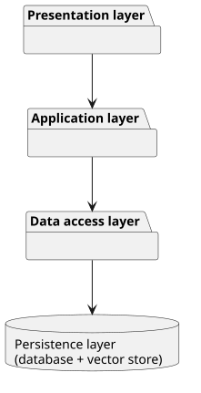
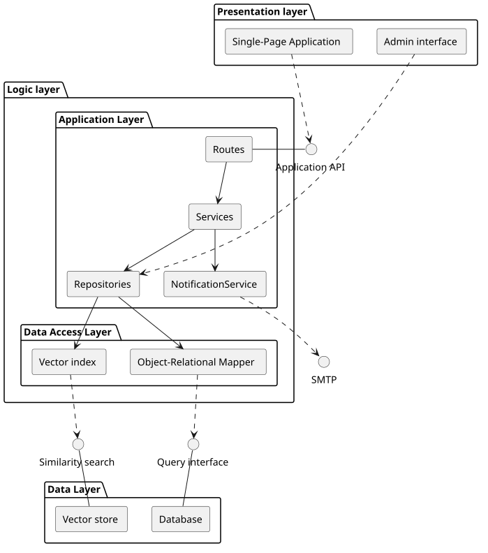
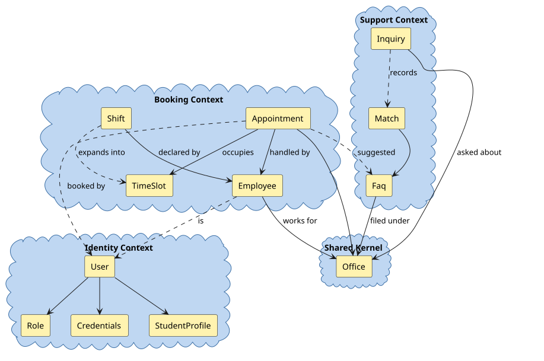
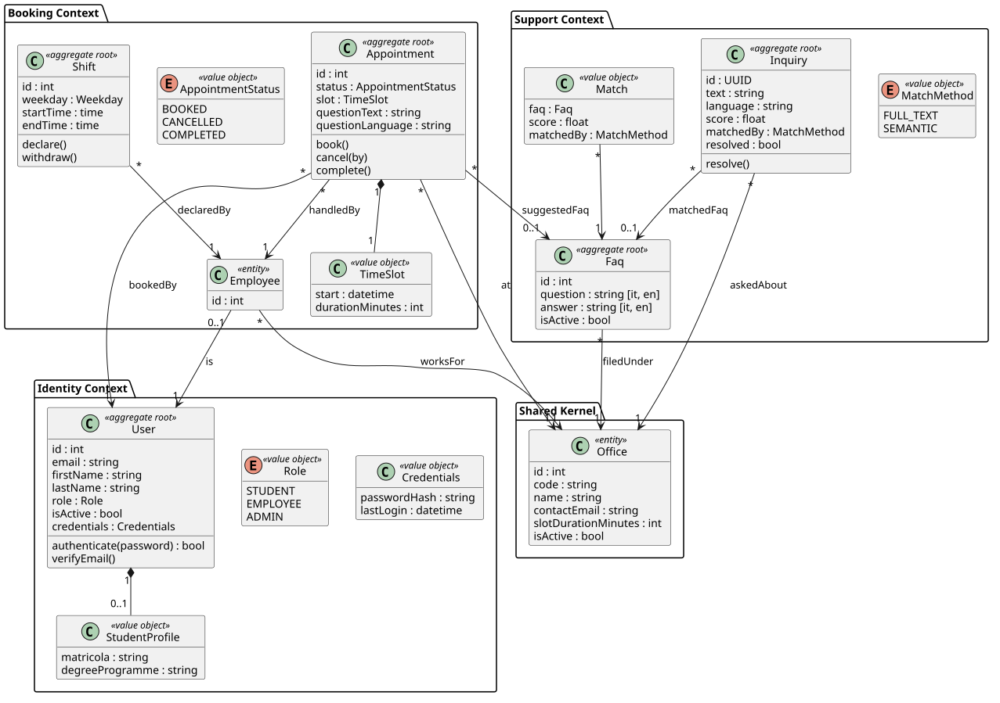
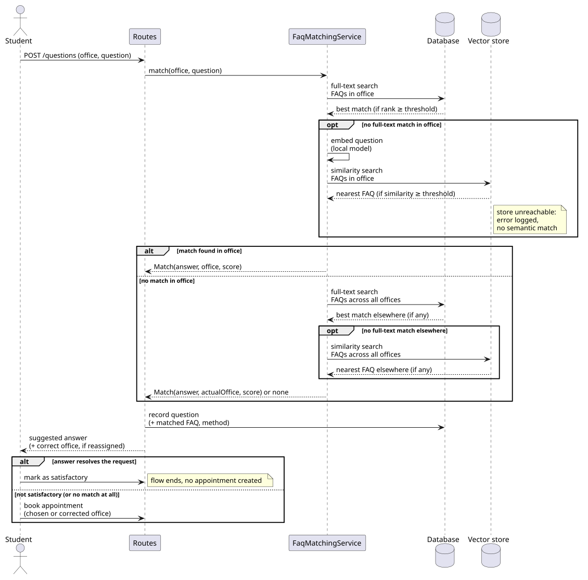
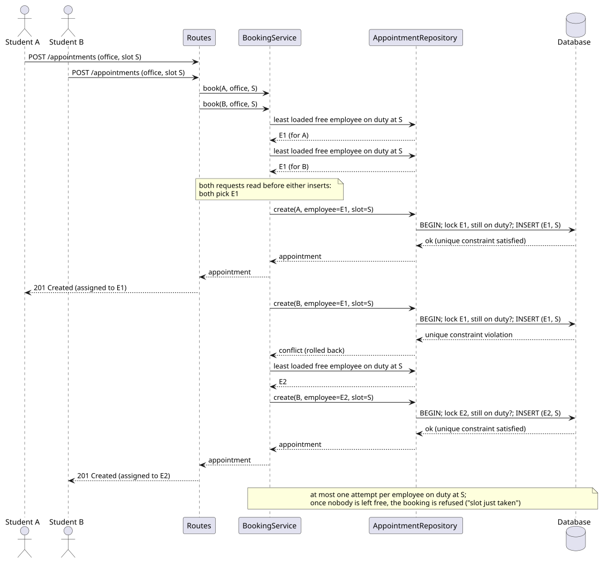
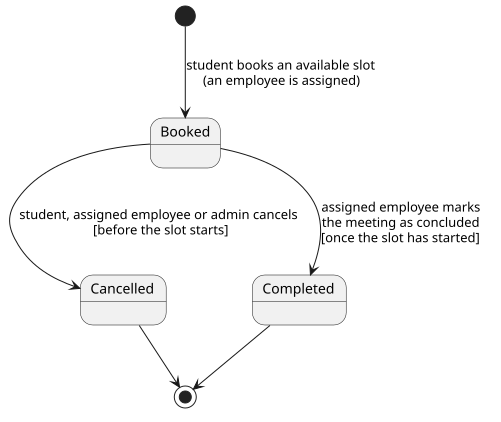

# Design

This chapter describes the design strategies adopted to meet the requirements identified in the analysis. The design is presented independently of the technologies chosen for the implementation.

## Architecture

### Architectural style

Pronto has a **layered** architectural style. The system is organised into four logical layers, each interacting only with the adjacent ones:

- **Presentation layer**: the client application, responsible for the user interface;
- **Application layer**: the backend, responsible for all business logic;
- **Data access layer**: the object-relational mapping component (ORM) and the vector index, responsible for translating between domain objects and storage operations;
- **Persistence layer**: the database, responsible for durably storing data, and the vector store, which holds the embeddings of the published FAQs used by semantic matching.

This choice reflects the actual communication pattern of the system: every interaction follows a synchronous request/response flow.

We considered and discarded the following alternatives:

- **Event-based**: it implies asynchronous, decoupled communication through a publish/subscribe mechanism, where producers are unaware of their consumers, which is not suitable.
- **Object-based**: it implies communication through remote invocation of methods on distributed objects. Pronto's components communicate through explicit request/response message exchanges, not through remote method calls on shared objects.
- **Shared dataspace**: Pronto does rely on a database and a vector store, but both are accessed by a single component (the backend).

### Concrete architecture

Concretely, Pronto adopts a **3-tier** architecture:

- **Presentation tier**: a single-page application running in the user's browser, used by students and employees, and an administration interface, served by the backend, used by the staff who run the helpdesk;
- **Logic tier**: the backend, exposing the API consumed by clients and encapsulating booking, FAQ, authentication and notification logic; comprises the ORM component and the vector index;
- **Data tier**: a relational database and a vector store.

The four logical layers map onto the three tiers as follows: the presentation layer coincides with the presentation tier; the application and data access layers together form the logic tier, since the ORM component and the vector index run in the same process as the backend; the persistence layer coincides with the data tier.

### Responsibilities of each component

**Presentation tier**: the single-page application renders the user interface and collects user input. It translates user actions into requests towards the backend's API, and renders the responses it receives, including FAQ suggestions, booking confirmations and authentication state. The administration interface lets the helpdesk staff review and publish FAQs, maintain offices, and oversee users and appointments.

**Logic tier (backend):** it encapsulates all business logic, and is internally organised into the following components:

- **Routes**: expose the API endpoints, authenticate the caller, check that their role allows the action, parse and validate incoming requests, and delegate to the appropriate service;
- **Services**: implement the business rules: the matching of questions against the FAQs, the computation of availability and the assignment of bookings, the lifecycle of appointments;
- **Repositories**: mediate between services and the data access layer, encapsulating domain-specific query logic behind a stable interface and keeping services decoupled from the underlying persistence technology;
- **NotificationService**: reacts to lifecycle events raised by the services (an appointment being booked or cancelled) and, once the change is committed, delivers the corresponding e-mail to an SMTP server;
- **Data access layer**: the ORM translates domain objects into relational operations and vice versa, allowing the logic tier to work with objects instead of hand-written queries; the vector index turns texts into embeddings, with a model run inside the backend itself, and reads and writes them in the vector store.

**Data tier:** the database durably stores all application state: users and student profiles, offices, employees and their shifts, appointments, FAQs, and the questions students ask. The vector store keeps one embedding per published FAQ and language: derived data, never edited directly, which can be rebuilt from the database at any time.

## Infrastructure

### Infrastructural components

Pronto's infrastructure comprises the following components:

- **Clients (N instances)**: each user, either a student or an employee, interacts with the system through a web browser running the single-page application; the helpdesk staff use the administration interface from a browser too. The number of client instances therefore is equal to the number of concurrently connected users.
- **Application server (1 instance)**: a single instance of the backend serves the API consumed by clients and the administration interface. The embedding model used by semantic matching runs inside this process, so no external embedding service is involved.
- **Database server (1 instance)**: a single database instance persists all application data.
- **Vector store server (1 instance)**: a single instance stores the FAQ embeddings and answers similarity searches. It is optional: if it is missing or unreachable, FAQ matching falls back to full-text search alone.
- **SMTP server**: notification e-mails (booking and cancellation notices, and the link that verifies a new account) are handed to an external SMTP server. In development the backend prints them instead.

### Distribution of components

Clients and server are geographically distributed: clients run wherever users are, and reach the server over the public Internet through secure connections.
Backend, database and vector store run as containers on the same host, attached to a private network: only the backend connects to the database and the vector store, which are exposed outside that network only to the host itself. During development, the team can also work against a shared database hosted by a managed provider, reached over an encrypted connection; its schema is kept in step with the integration branch by the CI pipeline.

The SMTP server is a third-party service, reached by the backend through outbound connections; its physical location is outside our control. The embedding model is downloaded from a public model repository the first time it is needed, and cached on the application server afterwards.

### Naming and discovery

Clients discover the server through public DNS: the application is reached through a stable hostname, resolved by the standard DNS infrastructure. The backend discovers the database and the vector store through the name-based service discovery offered by the container runtime: components on the private network are referred to by stable, logical service names, which the environment resolves at runtime and which the backend reads from its configuration. The SMTP server and the hosted database are discovered through public DNS, like any external service.

## Modelling

### Domain-driven design (DDD) modelling

**Bounded contexts**

Pronto's domain decomposes into three bounded contexts:

- **Booking context**: everything concerning the reservation of appointments with university offices: the employees staffing them, their shifts, the availability derived from those shifts, and the lifecycle of an appointment;
- **Support context**: the knowledge base answering students' questions before a booking takes place: the FAQs, the questions students ask, and the matching between the two;
- **Identity context**: users, roles, credentials and authentication.

**Office** is shared by the Booking and the Support contexts, which both file their data under an office: it forms a **shared kernel**, so that neither context has to depend on the other for it.

**Domain concepts**

Within the Booking context, **Appointment** is an entity and an aggregate root, binding the student, the handling employee, the Office, and the TimeSlot (a value object) it occupies; it also carries the student's question and, if any, the FAQ the student was suggested and found unsatisfactory. **Shift** is an entity and the second aggregate root of the context: it is declared and withdrawn by an employee independently of any appointment, and it is the source from which availability is computed; changing a shift means withdrawing it and declaring another, so that the rules on both sides apply to every change. **Employee** is an entity that links a user with the employee role to the office they work for.

Within the Support context, **Faq** is an entity and an aggregate root, composed of a question and an answer, each in Italian and English, and filed under an office; only published FAQs are suggested. **Inquiry** is the second aggregate root: it records a question a student asked about an office, the FAQ it was matched to (if any), how relevant that FAQ was, and whether the student found it resolutive. An inquiry deliberately keeps no link to the student who asked it, since it is kept to learn what the knowledge base lacks. **Match** is a value object.

Within the Identity context, **User** is an entity and the aggregate root of the context, with **Role** (student, employee or administrator), **Credentials** and, for students only, **StudentProfile** (student ID and course of study) as value objects.

**Repositories and services**

Each aggregate root is paired with a repository, modelling an abstract collection of aggregates: ShiftRepository, AppointmentRepository, FaqRepository, InquiryRepository and UserRepository. The FAQs have a second, derived representation, the **FaqIndex**, which stores their embeddings in the vector store and answers similarity searches; it is never written by the services directly, but kept in step with FaqRepository by reacting to every change of a FAQ.

Three domain services capture operations that do not naturally belong to any single entity:

- **FaqMatchingService**, which compares a question against the published FAQs and produces a Match. It combines two matchers in cascade, behind a common interface: full-text search first and, only if it finds nothing relevant enough, semantic search over the FaqIndex. Each matcher has its own score and threshold, and the scores of the two are never compared. The cascade runs on the office the student chose first, and on every office only if it finds nothing there;
- **BookingService**, which spans across the Shift, Employee, Office and Appointment concepts: it computes availability, assigns each booking to an employee, and drives the lifecycle of appointments;
- **NotificationService**, which reacts to the AppointmentBooked and AppointmentCancelled events and delivers the corresponding e-mails.

No factories are introduced, as aggregates are simple enough to be constructed directly.

**Domain events**

The relevant domain events, per context, are:

- Booking context: ShiftDeclared and ShiftWithdrawn, which change the availability of an office; AppointmentBooked and AppointmentCancelled, which trigger the notifications;
- Support context: QuestionAnswered and QuestionUnanswered (an unanswered question, or one whose answer the student rejects, is precisely what triggers the booking flow), QuestionResolved, and FaqChanged, which brings the FaqIndex in line with the published FAQs;
- Identity context: UserRegistered, which triggers the e-mail with the verification link, and UserVerified, which activates the account.

### Object-oriented modelling

The class diagram below reifies the DDD model into concrete data types.

Four modelling decisions deserve emphasis. First, an Appointment references the booking student (a User) and the handling Employee, and the Employee must work for the Appointment's own Office. This invariant spans several objects and is not expressed by the structure itself: it holds by construction, because the BookingService only ever picks the employee among those of the office being booked. Second, an Appointment contains its TimeSlot by composition, since a slot has no meaning outside the appointment that occupies it; a slot is identified by its start alone, and its length is the slot duration of the office. Office stands as an independent entity referenced by association. Third, Match is a value object with no persistent identity: it materialises as the output of FaqMatchingService, and what it carries (the FAQ, the score and the matcher that found it) is copied into the Inquiry recording the question. Fourth, the dependencies between the Booking and the Support contexts run one way only: an Appointment references the FAQ the student was suggested, while neither Faq nor Inquiry knows anything of appointments.

The identifier of an Inquiry is a random UUID rather than a sequential number: it is handed to the client, which quotes it back to mark the question resolved, and a sequential identifier would let anyone resolve, or count, the questions of everybody else.

## Interactions

All interactions in Pronto are synchronous request/response exchanges: the client calls the backend's API, and the backend reaches the database, the vector store and the SMTP server within the scope of each request.

The first sequence diagram shows the defining end-to-end flow. Having chosen an office, the student submits a question, which the backend forwards to the FaqMatchingService; the service searches the office's FAQs in cascade: full-text search on the database first and, only if it finds nothing relevant enough, a similarity search on the vector store, over the embedding of the question computed locally. Each technique keeps its own score and threshold, and the first one to find a match wins; if the vector store cannot be reached, the error is logged and the full-text result alone is used. If the office the student picked has no good match, the search does not simply come back empty: the service runs the same cascade across every office's FAQs, and if a match turns up elsewhere, it returns that answer together with the office that actually owns it. This turns a dead end into routing: instead of "no answer found", the student is told which office actually handles their question and can book there directly. The question is recorded as an Inquiry, together with the suggested FAQ, and the suggestion is presented to the student; the decision to stop there is theirs alone: the system never resolves a request on their behalf. If the student marks the answer as satisfactory, the flow ends and no appointment is created. If they do not (or no match was found at all), the client requests the relevant office's availability and the student picks a slot, which the BookingService turns into an appointment carrying the original question and the FAQ the student was suggested.

The second diagram addresses concurrent reservations. Since an office may be staffed by several employees, a time slot is not a single resource but a set of interchangeable ones: the BookingService selects the least loaded employee on duty and free in that slot, counting their booked appointments, and attempts the insertion. Since two simultaneous requests may both read before either inserts, they may pick the same employee. The persistence layer enforces the uniqueness of the (employee, time slot) pair among booked appointments, making the check-and-insert atomic: the first insertion succeeds and the second is rejected and rolled back. The BookingService then retries with the next available colleague, making at most one attempt per employee on duty, and refuses the booking only once every employee covering that slot has been taken. Each attempt also locks the chosen employee and checks again that they are still on duty, so that a shift withdrawn at the same moment cannot leave an appointment outside any shift; symmetrically, a shift that still covers booked appointments cannot be withdrawn.

Furthermore, notification e-mails are sent to the SMTP server only once the transaction that booked or cancelled the appointment has committed, so a booking that fails tells nobody; delivery is best-effort, and a notification failure is logged without undoing the booking. Changes to the FAQs reach the vector store in the same way: after the transaction commits, and without blocking the change if the vector store is down. Authentication is token-based: a new account stays inactive until its owner opens the verification link e-mailed at registration; upon login, the backend issues an opaque token, stored in the database, which the client attaches to every subsequent request and the backend looks up before serving it; the token is deleted at logout.

## Behaviour

Most of Pronto's components are stateless: the backend holds no per-user session in memory (authentication tokens are stored in the database), the FaqMatchingService computes matches from scratch on every request, and the client keeps only transient UI state. All persistent state lives in the database, and the only component allowed to update it is the backend's repository layer, always within the scope of a single request. The vector store holds no state of its own: its content is derived from the published FAQs, and is updated only after a change to them has been committed.

The one domain concept whose state evolves through multiple transitions is Appointment. An appointment is created in the BOOKED state, already assigned to an employee, and reaches one of two terminal states: CANCELLED, when the student, the assigned employee or an administrator calls it off before the slot starts, or COMPLETED, when the employee who handled the meeting marks it as concluded, which is only possible once the slot has started. A cancelled appointment stays on record, but no longer reserves its employee, so the slot becomes bookable again.

Two other concepts have a simpler, two-state life: a User is created inactive and becomes active when the verification link is opened, and an Inquiry is created unresolved and becomes resolved when the student marks the suggested answer as satisfactory, which is only possible if an answer was suggested.

## Data-related aspects

Pronto persists six families of data, mirroring the bounded contexts: user-related data (including student profiles), office-related data, employee- and shift-related data, appointment-related data, the FAQ collection, and the questions students ask.
Availability is deliberately not stored: it is derived at query time by expanding the shifts of an office's employees into candidate slots and subtracting those already taken by booked appointments.

No data is shared between components other than through the database itself, which acts as the single source of truth. The vector store is no exception: it holds a derived copy of the published FAQs, in the form of embeddings, which can always be rebuilt from the database.
